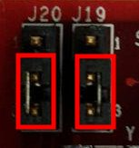

Let's boot
==========

Make sure that TWR-LS1021A boot mode jumpers are set like in the following picture:

.. image:: _static/sdcard-jumpers.jpg
    :align: center

Insert the SD card you just prepared inside socket **J18**.

Set the jumpers **J20** and **J19** pin2-3:

Connect the power supply cable to PWR JACK J3.

Connect the mini-USB cable from your PC to TWR-LS1021A USB connector.

And now proceed by setting up the serial console.

Give *root* to the login prompt:

.. raw:: html

 

 
<b class="admonition-board">&nbsp;&nbsp;Board&nbsp;&nbsp;</b>&nbsp;&nbsp;<a style="float: right;" href="javascript:select_text( 'boot_rst-board-191' );">select</a>

 <pre class="line-numbers pre-replacer" data-start="1"><code id="boot_rst-board-191" class="language-markup">ls1021atwr login: root</code></pre>
 
 
 

and press *Enter*.

.. note::

 Sometimes, the time you spend setting up minicom makes you miss all the output that leads to the login and you see just a black screen, press *Enter* then to get the login prompt.
