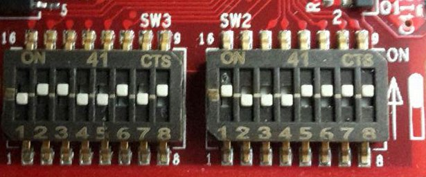
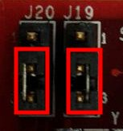

Make sure that **SW2** and **SW3** switches are set like in the following picture:

and the **J20** and **J19** jumpers as well.

Insert the SD card you just prepared inside socket **J16**.

Connect the mini-USB cable from your PC to TWR-LS1021A connector **J5**.

And now proceed by setting up the serial console.

.. include:: serial_console.rst

.. warning::

 The next procedure changes the boot mode of the u-boot. This step is necessary in order to use the files built by Yocto but could make not usable others sd-card built with other SDK.

Before starting to work with the SD-Card built by SDK, it is necessary modify u-boot environment variables.
Turn on the board and before the countdown ends press *Enter* key. Will be shown the u-boot prompt, then insert the following commands:

.. raw:: html

 

 
<b class="admonition-board">&nbsp;&nbsp;Board&nbsp;&nbsp;</b>&nbsp;&nbsp;<a style="float: right;" href="javascript:select_text( 'quick_boot_rst-board-211' );">select</a>

 <pre class="line-numbers pre-replacer" data-start="1"><code id="quick_boot_rst-board-211" class="language-markup">=&gt; setenv bootargs root=/dev/ram rw console=ttyS0,115200
 =&gt; fatload mmc 0 0x82000000 uImage
 =&gt; fatload mmc 0 0x8f000000 uImage-ls1021a-twr.dtb
 =&gt; fatload mmc 0 0x88000000 fsl-image-core-ls1021atwr.ext2.gz.u-boot
 =&gt; bootm 0x82000000 0x88000000 0x8f000000</code></pre>
 
 
 

| Then wait the end of the kernel boot.
|
| Give *root* to the login prompt:

.. raw:: html

 

 
<b class="admonition-board">&nbsp;&nbsp;Board&nbsp;&nbsp;</b>&nbsp;&nbsp;<a style="float: right;" href="javascript:select_text( 'quick_boot_rst-board-212' );">select</a>

 <pre class="line-numbers pre-replacer" data-start="1"><code id="quick_boot_rst-board-212" class="language-markup">ls1021atwr login: root</code></pre>
 
 
 

and press *Enter*.

.. note::

 Sometimes, the time you spend setting up minicom makes you miss all the output that leads to the login and you see just a black screen, press *Enter* then to get the login prompt.

